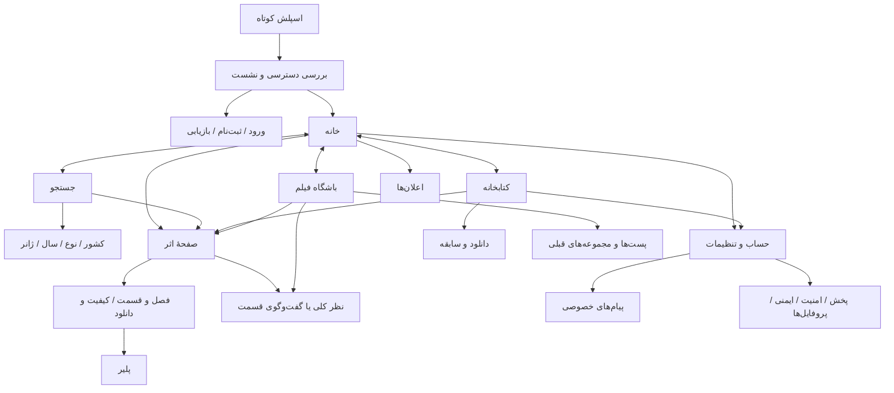

# FILMIQOO — بازطراحی محصول 0.7.0

تاریخ بررسی: ۲۰۲۶-۱۰-۰۵. این سند تصمیم و دامنهٔ کد را ثبت می‌کند. نتیجهٔ اجرای آخرین commit، شناسهٔ artifact و SHA-256 فایل نصب در گزارش تحویل کنار APK درج می‌شود. «پیاده‌سازی‌شده» در این سند به معنی فعال‌شدن روی سرور اصلی نیست.

## وضعیت مبنا و مرز تحویل

- مخزن `Awmirai/filmiqoo`، شاخهٔ موجود `cinema-redesign-iran-access`، [PR پیش‌نویس 24](https://github.com/Awmirai/filmiqoo/pull/24). مبنای پیش از این مأموریت `e7bc1446ab254c5cb6b0e4ef8dbdcb12b271f2b9` است. شروع کار با درخت تمیز انجام شد؛ تغییر ثبت‌نشدهٔ کاربر وجود نداشت. دستور اختصاصی AGENTS.md پیدا نشد.
- `main` در بررسی مبنا `4f636c7b05a1552b8e326c098bbcf2ef277034cf` بود. این مأموریت merge، انتشار عمومی، restart سرویس یا migration تولید انجام نمی‌دهد؛ درخواست قبلی مالک «فقط فایل‌ها» است.
- ساختار واقعی: Android/Kotlin 2.0.21، Compose BOM 2024.12.01، AGP 8.7.3، minSdk 26/targetSdk 35؛ بک‌اند Go 1.24 و PostgreSQL/Redis. تغییر چارچوب یا ارتقای غیرضروری وابستگی انجام نشده است.
- ویندوز محلی فضای کم و شبیه‌ساز آماده ندارد؛ adb محلی در ساخت پوشهٔ کاربر خطای مجوز داشت. این محدودیت محیط است. اجرای اندروید در CI روی emulator x86_64 Android 35 / Google APIs / Pixel 2 انجام می‌شود. این دستگاه فیزیکی Samsung نیست.
- harness تصویری ابتدا روی کد مبنا اجرا شد. ایرادهای بازطراحی از خطای مبنا جدا نگه داشته می‌شوند: در توسعهٔ فهرست «دیده‌شده»، پذیرش نام مخزن جدید جا افتاده بود؛ مسیر با آزمون ذخیره/بازیابی پوشش داده و اصلاح شد. این خطا مربوط به کد جدید بود، نه کرش قدیمی پلیر.
- نسخهٔ تحویل `0.7.1-product-preview`، versionCode 10، نوع debug Preview، شناسهٔ `com.filmiqoo.previewfix.preview`. کلید مجاز Preview قبلی حفظ می‌شود؛ کلید انتشار عمومی جایگزین نشده است. R8 release smoke تنها آزمون ساخت است، نه release منتشرشده.

## تصمیم محصول و ناوبری

کاربر برای پیدا کردن اثر، تماشا، نگه‌داشتن فهرست و گفت‌وگو دربارهٔ همان اثر می‌آید. چهار مقصد اصلی «خانه / جستجو / باشگاه فیلم / کتابخانه» همین چهار کار را نام می‌برند. پیام خصوصی از حساب قابل دسترسی است؛ اعلان‌ها از زنگ خانه. هر دو مخزن و مسیر مستقل دارند.

تب‌ها SaveableStateProvider مستقل دارند. مسیر overlay و stack در ViewModel بدون Context نگه داشته می‌شود؛ state قابل ذخیرهٔ صفحهٔ زیر پلیر هنگام رفت‌وبرگشت حفظ می‌شود. مسیر بسته‌شده از state holder حذف می‌شود. فرم ورود، جستجو، فصل/فیلتر قسمت و متن نظر از rememberSaveable استفاده می‌کنند. حفظ مسیر پس از نابودی کامل process ادعا نمی‌شود؛ تست بازسازی state با تست مرگ process متفاوت است. لینک قدیمی پست، کاربر را به پست‌های قبلی می‌برد؛ پیام‌ها و سوابق پاک نشده‌اند.

## فهرست صفحه‌ها و تصمیم‌ها

این فهرست از MainActivity/OverlayRoute و composableهای موجود استخراج شده است؛ «حفظ» یعنی مسیر موجود نگه داشته شده و الزاماً بازطراحی کاملِ صفحه نیست.

| صفحه | کار کاربر و ورودی | نتیجه | مسئلهٔ مبنا / تصمیم |
|---|---|---|---|
| اسپلش | بازکردن اپ | ورود به بررسی دسترسی | حفظ لوگوی متحرک؛ حذف مکث اضافه؛ 850ms و حالت کاهش حرکت |
| دسترسی ایران | شروع اپ / پاسخ ممنوع API | اجازه یا توضیح و retry | حفظ سیاست سرور؛ Preview سازگار با endpoint قدیمی؛ عدم ادعای اقامت از روی IP |
| ورود، ثبت‌نام، بازیابی | شروع / اقدام نیازمند حساب | نشست یا خطای قابل اصلاح | برند کوچک‌تر، فرم با عرض حداکثر 520dp، اسکرول و IME؛ حفظ بازیابی و نبود dev login در release |
| خانه | تب اول | ادامهٔ تماشا یا انتخاب اثر | تصویر تمام‌قد و ابزارهای پراکنده؛ بازسازی با ادامهٔ تماشا در بالا، hero کوتاه، ردیف‌های بدون تکرار |
| جستجو | تب دوم | فیلم/سریال واقعی | جستجوی چندمنظورهٔ مبهم؛ تمرکز بر عنوان، history، فیلتر واقعی و لغو درخواست قدیمی |
| کشف منطقه‌ای | جستجو → کشور/ژانر/سال، ردیف خانه | فهرست صفحه‌بندی‌شده | حفظ ایران/کره/هند/جهان و فیلترهای واقعی؛ عنوان کره/هند انگلیسی |
| جزئیات فیلم | هر پوستر | پخش/ادامه، کیفیت، ذخیره و نظر | hero کوتاه، اطلاعات خوانا، CTA متصل به نسخهٔ واقعی و ادامهٔ ثبت‌شده |
| جزئیات سریال | پوستر سریال | انتخاب فصل/قسمت | فصل و قسمت پیش از بازیگران؛ میانبر مستقیم؛ عکس و پیشرفت واقعی؛ دو ستون در فضای کافی |
| کیفیت/دانلود | صفحهٔ فیلم یا قسمت | نسخهٔ موجود یا صف دانلود | حفظ لیست واقعی فایل، حجم، صدا/زیرنویس؛ عدم ادعای قابل پخش بودن عنوان صرفاً فراداده‌ای |
| پلیر | دکمهٔ تماشا | پخش، seek، ابزار و بازگشت | حفظ رفع AppCompat/Cast crash و sheet؛ زمان پنهان‌شدن سازگار با AccessibilityManager |
| دیدگاه اثر/قسمت | پایین صفحهٔ اثر / باشگاه | ارسال، پاسخ، پسند، ویرایش/حذف | scope مستقل قسمت، dataset مشترک، متن محفوظ در خطا، retry با clientId ثابت |
| باشگاه فیلم | تب سوم | تصمیم با نظر مرتبط با عنوان | فید عمومی، اتاق‌ها و استوری از صفحهٔ اول برداشته شدند؛ فید title_comments جایگزین شد |
| پست‌ها و مجموعه‌های قبلی | پایین باشگاه / لینک پست | دسترسی به محتوای موجود | مسیر انتقال روشن؛ حفظ داده و UI قدیمی در کاربرد مشخص، بدون ادعای بازسازی کامل آن |
| کتابخانه | تب چهارم | برای تماشا / دیده‌شده / پسندیده | تفکیک ذخیره از دانلود؛ ادغام نمایشی حساب و دستگاه بدون حذف سابقه |
| مجموعه‌ها و نشانک‌های حساب | کتابخانه | مجموعه/نشانک‌های قبلی | حفظ LibraryScreen قدیمی برای داده‌هایی که در سه فهرست جدید نیستند |
| دانلودها | کتابخانه | صف، وضعیت و پخش آفلاین | حفظ مدیر واقعی دانلود و سیاست Wi-Fi/باتری؛ قالب مشترک موجود |
| سابقهٔ پخش | کتابخانه | بازکردن اثر یا ادامه | حفظ API و سوابق؛ جدا از علامت دستی «دیده‌ام» |
| حساب و تنظیمات | آواتار خانه/کتابخانه | یافتن تنظیمات و حساب | بازسازی صفحهٔ راهنما؛ خطای پروفایل مانع دسترسی به تنظیمات نمی‌شود |
| پیام‌های خصوصی / Room | حساب / لینک گفتگو | گفتگو با هویت فرستنده | انتقال از تب اصلی؛ حفظ archive، unread، block و گفتگوهای موجود؛ هدف روشن‌تر |
| اعلان‌ها | زنگ خانه / اعلان سیستم | پیگیری انتشار و فعالیت | header کوتاه، فیلتر با نام روشن، خطای mark-read قابل مشاهده؛ مستقل از inbox |
| تنظیمات | حساب | تغییر پخش/داده/حریم خصوصی | حفظ گزینه‌های متصل، اصلاح rollback شکست ذخیره، جلوگیری از دو ذخیرهٔ همزمان |
| ویرایش پروفایل | حساب | نام/تصویر حساب | حفظ فرم و API؛ پوسته و مسیر مشترک |
| پروفایل‌های تماشا | حساب | انتخاب بزرگسال/کودک | حفظ پروفایل و محدودیت کودک؛ تب اجتماعی برای کودک نمایش داده نمی‌شود |
| دروازه/کنترل والدین | حساب / تغییر حالت کودک | PIN و سیاست سن | حفظ مسیر امن؛ ارتقای سرور مرتبط مستقل از طراحی است |
| امنیت حساب | حساب | نشست‌ها و تنظیم امنیت | حفظ مسیر موجود؛ مقصد فرعی واضح |
| ایمنی | حساب / گزارش نظر | مسدود/بی‌صدا/گزارش | حفظ API، retry مسدودسازی نظر دوباره کاربر را unblock نمی‌کند |
| درخواست دنبال‌کردن / دوستان نزدیک | فعالیت‌های قبلی حساب | مدیریت ارتباط‌ها | حفظ داده؛ مقصد اصلی نیست |
| فعالیت دوستان / Film DNA / اعتبار | فعالیت‌های قبلی حساب | مشاهدهٔ فعالیت و سلیقهٔ موجود | حفظ مسیر فرعی؛ پیشنهاد شخصی جعلی در خانه ساخته نشد |
| پروفایل سازنده / مدیریت کانال / استودیو | نویسنده / فعالیت قبلی | دیدن یا مدیریت محتوای حساب | حفظ دسترسی و مالکیت؛ بازطراحی کامل ابزارهای سازنده ادعا نمی‌شود |
| بازیگر و کارگردان | جزئیات → عوامل | آثار مرتبط | حفظ مسیر متصل به metadata |
| تقویم انتشار / تقویم سریال | خانه / حساب | قسمت‌های تازه یا دنبال‌شده | حفظ API و اشتراک واقعی |
| کلیپ / Story / SocialStories | مسیر قبلی یا لینک | دیدن محتوای موجود | حفظ داده؛ از خانه و جزئیات جایگاه تبلیغاتی برداشته شد؛ feed عمومی محور محصول نیست |
| تماشای گروهی / Live / Create | مسیرهای قبلی و deep link | قابلیت‌های قدیمی | حفظ سازگاری؛ آزمون تولید/جلسه چندکاربره انجام نشده و مقصد اصلی نیست |
| دیالوگ یادداشت | جزئیات | یادداشت خصوصی دستگاه | متن در بازسازی صفحه حفظ می‌شود؛ همگام‌سازی ابری ادعا نشده |
| خطا، خالی، بارگیری، offline جزئی | همهٔ جریان‌های اصلی | retry بدون از دست دادن داده | حالت‌های مستقل، حفظ تازه‌های کاتالوگ و ادامهٔ تماشا هنگام خطای موقت |

پیام‌های واقعی در schema/API موجودند؛ برای این مأموریت محتوای خصوصی کاربران تولید خوانده نشده و تعداد گفتگوهای واقعی حدس زده نشده است. نبود شمارش تولید مجوز حذف هیچ جدول یا سابقه‌ای نیست.

## تحقیق و اثر آن بر پیاده‌سازی

منابع زیر در ۲۰۲۶-۱۰-۰۵ بررسی شدند. نصب و پیمایش حساب‌دار رقبای نام‌برده انجام نشده است. شماره نسخهٔ فروشگاه، شمارهٔ رابطِ تصویر تبلیغاتی را تضمین نمی‌کند. منابع عمومی و راهنمای رسمی با تصویر اجرای FILMIQOO اشتباه گرفته نمی‌شوند.

| مرجع / پلتفرم / نسخه | مشاهده و محدودیت | تصمیم برای FILMIQOO و چیزی که کپی نمی‌شود |
|---|---|---|
| Netflix موبایل؛ نسخه عددی تأیید نشده | [اعلام طراحی 2026](https://about.netflix.com/en/news/introducing-exciting-new-ways-to-find-and-enjoy-your-next-favorite-on-mobile) و [راهنمای ناوبری](https://help.netflix.com/en/node/575087423404644): Home، Clips، Search، My Netflix؛ اتصال کلیپ به عنوان/ذخیره؛ راهنما، نه نصب اندروید | چهار کار روشن و اقدام مرتبط با عنوان؛ فید autoplay و شخصی‌سازی Netflix کپی نشد چون زیرساخت آن در این اپ اثبات نشده |
| فیلیمو Android، 4.55، تاریخ فروشگاه ۳۰ شهریور ۱۴۰۵ | [صفحه ناشر](https://cafebazaar.ir/app/com.aparat.filimo)، [صفحه رسمی اپ](https://www.filimo.com/app). تصویر اول بازشده تبلیغ پوستر بود؛ مدرک ناوبری فعلی نیست. توضیح ناشر: دسته‌بندی، کیفیت و offline | کشور/ژانر و فایل قابل پخش واضح؛ بنر تمام‌قد تبلیغاتی و ساختار خرید/اکران در خانه کپی نشد |
| نماوا Android؛ نسخه عددی نامشخص، Play به‌روز ۴ اکتبر ۲۰۲۶ | [ناشر my shatel در Play](https://play.google.com/store/apps/details?id=com.shatelland.namava.mobile)، [صفحه رسمی](https://www.namava.ir/app). توضیح جدید شامل history جستجو، پروفایل و double-tap؛ تصویر مشاهده‌شده پروفایل‌های تماشا در قاب تبلیغاتی است | history واقعی و پروفایل قابل پیش‌بینی؛ ادعای recommendation اختصاصی بدون داده یا وعده مصرف اینترنت اپراتوری کپی نشد |
| فیلم‌نت Android، 1.17.14 CB، ۶ مهر ۱۴۰۵ | [ناشر در بازار](https://cafebazaar.ir/app/ir.filmnet.android)، [دانلود رسمی تفکیک موبایل/TV](https://filmnet.ir/apps). تصویر اول پوستر تبلیغاتی در قاب گوشی؛ توضیح ناشر درباره زبان/زیرنویس/کیفیت و نشان‌کردن | اقدام تماشا و مشخصات نسخه در صفحهٔ اثر؛ طرح پوستر تبلیغاتی و الگوی Android TV به‌عنوان رابط موبایل کپی نشد |
| Letterboxd وب/راهنمای محصول؛ نسخه عددی ندارد | [FAQ رسمی](https://letterboxd.com/about/faq/): نقد متصل به فیلم، diary، watchlist. آزمون اپ موبایل انجام نشده | باشگاه حول title_comments و جدا بودن «دیده‌ام» از «برای تماشا»؛ شمارندهٔ اجتماعی یا کاربران نمونه در خروجی واقعی ساخته نشد |
| Prime Video؛ اطلاعیهٔ طراحی چندپلتفرمی ۲۰۲۴ | [منبع Amazon](https://www.aboutamazon.com/news/entertainment/prime-video-updated-steaming-experience). منبع تاریخی است، شاهد نسخهٔ فعلی اندروید نیست | وضوح در دسترس بودن و اقدام اصلی؛ پیچیدگی خرید/اجاره و کانال‌های اشتراکی منتقل نشد |
| Disney+؛ راهنمای عمومی سرویس | [ناوبری](https://help.disneyplus.com/en-GB/article/disneyplus-en-cz-navigate-app)، [کنترل‌ها](https://help.disneyplus.com/en-GB/article/disneyplus-en-ae-player-controls). متن نمایه‌شدهٔ رسمی قابل خواندن بود، بدنهٔ مستقیم JS کامل استخراج نشد؛ نصب/نسخه تأیید نشده | ادامهٔ تماشا، کیفیت/زیرنویس و قسمت بعد باید عمل مشخص داشته باشند؛ طرح وب/TV به موبایل تعمیم داده نشد |
| Apple TV روی Android؛ راهنمای Android | [راهنمای رسمی](https://support.apple.com/en-kg/guide/tvapp-android/dev5c3f3a908/web): تنظیمات زیر آیکون حساب، history/ادامه، داده و زبان. نسخه عددی و اجرای دستگاه تأیید نشده | تنظیمات ثانویه و ادامهٔ تماشای ثبت‌شده؛ تب‌های Store/Library از راهنمای TV به اندروید نسبت داده نشد |

پوشش مقایسه: خانه/ناوبری/ذخیره از راهنمای Netflix و توضیحات ناشران؛ جستجو از توضیح جاری نماوا و فیلترهای ایرانی؛ کیفیت/زیرنویس از توضیح فیلم‌نت و راهنمای Disney؛ ادامه از نماوا/Apple؛ اجتماع از Letterboxd. انتخاب قسمت و حالت‌های خالی تمام رقبا مستقیماً مشاهده نشده‌اند؛ طراحی آن‌ها در این پروژه حاصل تحلیل وظیفه و آزمون خود اپ است، نه ادعای کپی مشاهده‌شده. برای RTL، 48dp و تغییر چیدمان، [راهنمای اندازه پنجره](https://developer.android.com/develop/ui/compose/layouts/adaptive/use-window-size-classes)، [ناوبری تطبیقی](https://developer.android.com/develop/ui/compose/layouts/adaptive/build-adaptive-navigation) و [دسترس‌پذیری Compose](https://developer.android.com/develop/ui/compose/accessibility/api-defaults) مبنا بوده‌اند.

## سیستم طراحی

لوگو و نام موجود FILMIQOO حفظ شده‌اند. زمینه `#090B10`، سطح `#131720`، متن `#F6F7FA`، متن فرعی `#A8B2C4` و تأکید `#FF4155` در CinemaDesign/Theme مشترک‌اند. رنگ طلایی فقط برای امتیاز و نشانهٔ محدود استفاده می‌شود. متن دکمهٔ اصلی تیره است تا کنتراست کافی داشته باشد.

`CinemaTokens`: فاصلهٔ پایه 8dp، فاصلهٔ بخش 24dp، حاشیه 20dp، گوشهٔ کنترل 16dp، کارت 22dp، آیکون 24dp، لمس حداقل 48dp، عرض محتوای اصلی حداکثر 1120dp. پوستر 2:3 و قسمت تقریباً 16:8 است؛ تصویر Crop می‌شود و کش نمی‌آید. تصویر شکست‌خورده سطح خنثی و نشانهٔ فیلم دارد. Coil اندازهٔ view را برای decode استفاده می‌کند؛ metadata cache محدود به 48 مدخل و پنج دقیقه است، URL پخش در آن ذخیره نمی‌شود.

Vazirmatn با مجوز OFL موجود در `app/src/main/assets/vazirmatn-OFL.txt` حفظ شده است. ابعاد متن sp هستند و scale سیستم قفل نشده. برند/تیتر از وزن‌های موجود استفاده می‌کنند؛ فونت یا بستهٔ آیکون تازه اضافه نشده است. نوار اصلی آیکون‌های outlined هم‌خانواده و label ثابت دارد. زیر 600dp نوار پایین فضای واقعی layout را می‌گیرد؛ از 600dp به بالا rail با قابلیت scroll می‌آید. انتخاب قسمت در عرض حداقل 700dp و fontScale کمتر از 1.6 دو ستون می‌شود. در فونت بزرگ یک ستون باقی می‌ماند.

خانه با swipe دستی hero کار می‌کند؛ carousel خودکار و autoplay ندارد. ارتفاع تصویر hero از ارتفاع پنجره محاسبه و بین 128 و 230dp محدود می‌شود. دکمه‌های متنی ارتفاع منعطف دارند. اسپلش 850ms است و در خاموش بودن انیمیشن سیستم مسیر کوتاه دارد. تأخیر پنهان‌کردن کنترل پلیر توصیهٔ AccessibilityManager را رعایت می‌کند. پخش/seek در جهت زمان حفظ شده و به خاطر RTL آینه نشده است.

## داده، شبکه و اجتماع

- Home از تاریخچهٔ واقعی، metadata و کاتالوگ فایل استفاده می‌کند. عنوان‌های صرفاً metadata با عنوان قابل پخش یکسان جلوه داده نمی‌شوند. ردیف‌های عادی با کلید نوع/شناسه deduplicate می‌شوند؛ hero نقطهٔ معرفی جداگانه است. نام محبوبیت فقط به TMDB نسبت داده می‌شود، «مخصوص شما» اضافه نشده است.
- جستجو query نمایشی را دست‌کاری نمی‌کند؛ نسخهٔ نرمال‌شدهٔ ی/ک، ارقام و نیم‌فاصله برای درخواست ارسال می‌شود. debounce 350ms، لغو coroutine و ensureActive مانع جایگزینی پاسخ قدیمی‌اند. فیلترهای همه/فیلم/سریال روی دادهٔ واقعی اعمال می‌شوند؛ جستجوی بازیگر ادعا نمی‌شود. تاریخچه فقط پس از انتخاب نتیجه ثبت می‌شود.
- باشگاه همان `GET /v1/discussions/feed[/viewer]` را می‌خواند که آیتم‌های `title_comments` را با شناسهٔ اصلی بازمی‌گرداند. پایین صفحهٔ عنوان، scope همان اثر را می‌خواند. برای سریال `series:TMDB:sN:eN` و برای اثر بدون TMDB `catalog:UUID:sN:eN` داریم؛ reply میان دو scope رد می‌شود.
- بدنه/استیکر/GIF دارای spoiler پیش از اقدام کاربر وارد UI و درخت semantics نمی‌شوند. نمایش تبلیغاتی یا اعلان جدید برای متن این دیدگاه‌ها تولید نشده است. صفحه‌بندی keyset بیست‌تایی، clientId یکتا، مالکیت GIF آپلودشده و محدودیت 10MB از مسیر واقعی سرور استفاده می‌کنند.
- ویرایش فقط برای نویسنده، حذف با نگه‌داشتن پاسخ‌های دیگران، گزارش و فیلتر مسدودسازی دوطرفه واقعی‌اند. پاسخ ناموفق متن/پیوست و شناسهٔ retry را حفظ می‌کند. بدون نشست ارسال انجام نمی‌شود. پسندها پس از پاسخ موفق UI را به‌روز می‌کنند.
- migration `053_discussion_club.sql` افزایشی است: title_label، poster_path، edited_at، index فید، بازیابی نام عنوان‌های موجود. جدول پیام‌ها، نقدهای قدیمی، فهرست‌ها و تاریخچه حذف یا بازنویسی نشده‌اند. migration 052 از نسخهٔ قبلی همچنان لازم است. rollback اپ به نسخهٔ قبلی نیاز به حذف ستون‌ها ندارد؛ rollback دیتابیس تخریبی خودکار پیشنهاد نمی‌شود.
- شناسهٔ profile در کتابخانهٔ محلی حفظ می‌شود. seenItems فقط index افزایشی برای دادهٔ جدید است؛ seen boolean قدیمی محفوظ است. عنوان‌های قدیمی علامت‌خورده که metadata آن‌ها هرگز ذخیره نشده بود با مراجعهٔ مجدد قابل بازیابی‌اند؛ بازسازی جادویی metadata قبلی ادعا نمی‌شود.
- پاسخ 401 تمدید نشست، انتخاب پروفایل فعال را همراه token پاک می‌کند تا حساب بعدی شناسهٔ حساب قبل را ارسال نکند؛ فهرست‌های شخصی پاک نمی‌شوند. خطای موقت 503/429 در refresh نشست را حذف نمی‌کند. هر دو مسیر آزمون جدا دارند.

## پخش و Telegram

رفع کرش قدیمی از نسخهٔ مبنا حفظ شده: theme سازگار AppCompat برای MediaRouteButton/Cast و آماده‌سازی پلیر روی main thread. مشکل sheet قبلی ناشی از رد حالت hidden و نادیده‌گرفتن dismiss بود؛ مسیر اصلاح‌شده Back/scrim/swipe را می‌پذیرد. لایهٔ gesture روی PlayerView کنترل tap را می‌گیرد، دکمهٔ مخفی‌کردن وجود دارد و auto-hide هنگام sheet/scrub متوقف است. آزمون OnlinePlaybackTest فایل ویدئوی H.264/AAC متعلق به fixture را از HTTP دریافت و پیشرفت واقعی decode را بررسی می‌کند؛ این آزمون معادل پخش کامل فیلم روی گوشی کاربر یا Cast واقعی نیست.

parser ورودی Telegram ترکیب نام فایل و caption فارسی/انگلیسی، ارقام فارسی، فصل/قسمت و اولویت مشخصات فنی نام فایل را از نسخهٔ قبلی حفظ می‌کند. تازه‌های خانه هر هشت ثانیه هنگام STARTED بررسی می‌شوند. این زمان، تضمین «آنی» برای queue/metadata/transcode سرور نیست. خوانده‌شدن پست ۲۱ در بررسی قبلی و مدیر بودن ربات جایگزین آزمون پست جدید پس از deployment نیست. کد و migration جدید در تولید اجرا نشده‌اند.

## طرح اعتبارسنجی و وضعیت قابل ادعا

| بخش | وضعیت کد | مدرک/دامنه |
|---|---|---|
| چهار مقصد، خانه، جستجو، جزئیات، کتابخانه، حساب | پیاده‌سازی‌شده | مسیرهای MainActivity واقعی؛ ProductAuditTest و آزمون‌های تجربه/سفر محصول در CI؛ نتیجهٔ commit نهایی در گزارش تحویل |
| اشتراک دادهٔ باشگاه و عنوان، مالکیت و scope قسمت | پیاده‌سازی‌شده | آزمون Go با PostgreSQL مهاجرت‌داده‌شده: identity مشترک، edit مالک، block، cross-scope، cursor و retry |
| پخش آنلاین و بستن ابزارها | پیاده‌سازی‌شده | OnlinePlaybackTest با decode واقعی، auto-hide، tap و Back؛ سخت‌افزار واقعی/همهٔ codecها اجرا نشده |
| فرم‌ها، تنظیمات و ذخیرهٔ محلی | پیاده‌سازی‌شده | حفظ draft پس از 500، UUID retry، history، restore تب، جدایی profile، rollback ذخیرهٔ تنظیمات |
| طراحی واکنش‌گرا | پیاده‌سازی‌شده | اسکریپت 12 پروفایل؛ اندازهٔ واقعی configuration در JSON ثبت می‌شود، صرف label مدرک dp نیست |
| همهٔ ابزارهای فرعی قدیمی / جلسهٔ زنده چندکاربره | حفظ‌شده؛ بازطراحی کامل اجرا نشده | مسیرهای ثانویه عمداً برای حفظ دسترسی باقی‌اند؛ پوشش کامل انتهابه‌انتهای آن‌ها ادعا نمی‌شود |
| تولید، migration، محدودیت ایران در release عمومی | اجرا نشده / نیازمند مجوز مستقل | files-only؛ endpoint policy و دیتاست معتبر روی سرور باید پیش از انتشار آماده باشند |
| امضای release عمومی | مسدود تا دسترسی مجاز به تنظیمات/کلید انتشار | کلید Preview همان کلید قبلی است؛ APK آزمایشی جای release معرفی نمی‌شود |
| S24/S24 Ultra فیزیکی، fold hinge، Cast واقعی، TalkBack تعاملی | اجرا نشده | viewport مشابه، آزمون سخت‌افزار یا ارزیابی کاربر محسوب نمی‌شود |

ماتریس هدف: 320×800، 360×800، 393×852، 412×915، 480×960، 600×960، 840×1100، 840×393 افقی؛ fontScale=2 در 393 و 320؛ 393 با ناوبری سه‌دکمه‌ای و keyboard. بقیه gestural/font1 هستند. `wm density=160` به‌همراه configuration واقعی گزارش می‌شود. صفحه‌ها: خانه، جستجو، فیلم، سریال، قسمت‌ها، باشگاه، دیدگاه، کتابخانه، ورود، تنظیمات، inbox، اعلان. پلیر در suite پخش جداگانه تصویر دارد.

تصاویر از اجرای composableهای واقعی با داده و artwork تولیدشدهٔ androidTest هستند؛ نه mockup و نه اسکرین‌شات کاتالوگ تولید. دادهٔ نمونه داخل APK اصلی بسته‌بندی نمی‌شود. harness برای baseline فقط adapter پوسته دارد تا همان صفحه‌ها روی source قبلی اجرا شوند. زمان screenshot شامل انتظار تثبیت است و benchmark محسوب نمی‌شود.

زمان `am start -W` پنج مرتبه جمع‌آوری می‌شود؛ TTID اولین frame اسپلش است، نه آماده‌شدن شبکه/ورود. PSS صفحه‌ها، meminfo و gfxinfo نیز خام نگه داشته می‌شوند. benchmark کنترل‌شدهٔ startup، اسکرول یا آغاز پخش و درصد بهبود ادعا نمی‌شود. ارزیابی وظیفه توسط آزمون‌ خودکار، مطالعهٔ کاربر نیست.

فایل‌های اصلی تغییر: ProductDesign، MainActivity/Models/CinemaNavigationState، CinemaBrowseScreens/Spotlight، PremiumSearchScreen، FilmClubScreen/TitleDiscussion، PersonalLibraryScreen/CinemaPersonalStore، CinemaDetailContent/Screen، AccountScreen، Auth/Settings/InboxNotifications، Player/Splash؛ server/title_discussions و migration 053؛ ProductAuditTest/ProductJourneyTest، workflow و اسکریپت audit. فهرست دقیق diff از commit مبنا تا commit تحویل کنار خروجی ارائه می‌شود.

## اصلاح تکمیلی 0.7.1 — جهت زمانی پلیر

در بازبینی تصویر واقعی 0.7.0 مشخص شد فقط متن زمان LTR بود و Slider و ترتیب دکمه‌های عقب/جلو از RTL ارث می‌بردند. 0.7.1 جهت مستقل LTR برای همین دو بخش و نشانگرهای نوار زمان تعریف می‌کند؛ منوها و متن فارسی همچنان RTL هستند. PlayerTimelineTest جای فیزیکی عقب/جلو، callback هر دکمه، لمس چپ برای ابتدای ویدئو و لمس راست برای انتهای ویدئو را در میزبان RTL بررسی می‌کند. نتیجهٔ اجرای commit تازه در گزارش تحویل ثبت می‌شود. نسخهٔ 0.7.0 نگه داشته می‌شود اما 0.7.1 جایگزین پیشنهادی آن است.
